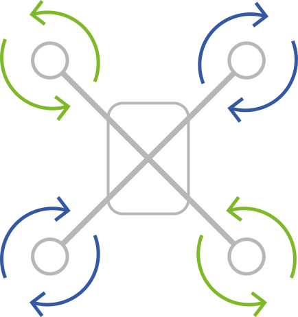
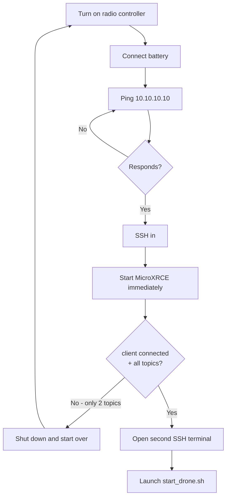

# General

## Setup & Startup

This section is the **operational runbook** — follow these steps every time you turn on the drone.
For in-depth technical documentation refer to `hardware.md`, `electronics.md` and `software.md`.

---

### Credentials and addresses

=== "Raspberry Pi (Ubuntu 24)"

    | Parameter   | Value           |
    |-------------|-----------------|
    | IP (eth)    | `10.10.10.10`   |
    | Subnet mask | `255.255.255.0` |
    | Hostname    | `Drone26-U24`   |
    | Username    | `raspberry`     |
    | Password    | `TechDrone26`   |

=== "Telemetry Bridge ESP8266 (QGC)"

    | Parameter | Value             |
    |-----------|-------------------|
    | SSID      | `TechDrone_Telem` |
    | Password  | `TechDrone26`     |

---

### Connecting to the Raspberry Pi

=== "Via Ethernet (recommended for operations)"

    Set your PC (or network adapter) to an IP in the `10.10.10.x` subnet (e.g. `10.10.10.5`), subnet mask `255.255.255.0`, gateway empty.
    Plug the ethernet cable directly into the RPi, then:

    ```bash
        ssh raspberry@10.10.10.10
    ```

=== "Via WiFi (NOT RECOMMENDED - unless you are in pre-flight/flight)"

    The RPi connects to the WiFi network and gets an IP via DHCP.
    To find the current IP:

    ```bash
        arp -a
    ```

        Then connect using the IP found:

    ```bash
        ssh raspberry@<IP>
    ```

    ??? info "WiFi not working?"
        The PC and Raspberry Pi must be connected to **the same WiFi network**.

        If the RPi is not connecting to the desired network (e.g. phone hotspot), configure it in the network settings:

        ```bash
            sudo nmcli dev wifi connect "NETWORK_NAME" password "PASSWORD"
        ```

        This only needs to be done **once per network** — the RPi will remember it.

---

### Battery mounting

Secure the battery to the **top of the drone** using the straps.

??? warning "Balance the weight before flying"
    The battery position affects the center of gravity — if it is off, the drone will tilt and fight itself in the air.

    **How to check:** lift the drone by pinching it at the center frame with two fingers. It should sit roughly level. If it tips forward or backward, slide the battery until it balances.

    In general, the battery should sit **slightly toward the rear** of the frame.

---

### Propeller mounting

The drone runs **props out** configuration.

| Motor position | Spin direction |
|----------------|----------------|
| Front-left     | Counter-clockwise (CCW) |
| Front-right    | Clockwise (CW) |
| Rear-left      | Clockwise (CW) |
| Rear-right     | Counter-clockwise (CCW) |

{ width="300" }

!!! danger "Wrong propeller direction = crash"
    Always double-check spin direction and propeller type (CW/CCW) before arming.
    Props out means CW props on CW motors and CCW props on CCW motors — do not swap them.

---

### Startup procedure

!!! warning "Turn on the radio controller BEFORE anything else"
    The ELRS radio controller must be turned on **before** connecting the battery to the drone.
    Never fly without QGroundControl open and connected.

!!! warning "Known issue — Pixhawk / Raspberry Pi timing"
    Raspberry Pi and Pixhawk both draw power from the same battery and boot simultaneously.
    MicroXRCE-DDS must be started **before** the Pixhawk finishes booting, otherwise it will not latch onto the PX4 topics.
    Follow the procedure below carefully.

!!! info "Required equipment"
    Operating the drone requires **2 computers**:

    - **PC 1** — connected to the RPi via ethernet (or WiFi), for SSH and monitoring
    - **PC 2** — connected to `TechDrone_Telem` WiFi, with QGroundControl open



**Step 1 — Turn on the radio controller**

Turn on the ELRS radio controller. Open QGroundControl on your PC and keep it ready.

**Step 2 — Connect the battery**

Connect the battery to the drone. Raspberry Pi and Pixhawk both power on simultaneously.

!!! note "Boot loop"
    The RPi sometimes goes into a boot loop or takes longer than usual to start up. This is normal — wait and retry the ping.
    If it hasn't booted after 5 minutes, hold the power button, then disconnect the battery, then reconnect.

**Step 3 — Wait for the RPi to be reachable**

```bash
ping 10.10.10.10
```

Do not proceed until you see replies.

**Step 4 — SSH in immediately**

As soon as the ping replies, connect right away:

```bash
ssh raspberry@10.10.10.10
```

**Step 5 — Start MicroXRCE-DDS immediately** ⚠️

This is the critical step. As soon as you are in, on the first terminal:

```bash
MicroXRCEAgent serial --dev /dev/ttyAMA0 -b 921600
```

Keep this terminal open and check the output:

- ✅ You see `client connected` **and all topics** → proceed to step 6
- ❌ You see only `running...` or only 2 topics → **shut everything down and restart from step 1**

**Step 6 — Start the rest with the tmux script**

Open a **second SSH terminal** and run:

```bash
./start_drone.sh
```

The script opens a tmux session with 6 windows:

| Window           | Content                                                                              |
|------------------|--------------------------------------------------------------------------------------|
| `0 - microxrce`  | Reference window (MicroXRCE disabled — already started manually in step 5)           |
| `1 - realsense`  | RealSense D435i driver                                                               |
| `2 - openvins`   | OpenVINS (VIO)                                                                       |
| `3 - vio_bridge` | VIO Bridge (publishes odometry to PX4)                                               |
| `4 - glances`    | System resource monitor                                                              |
| `5 - debug`      | Free terminal for debugging                                                          |

??? tip "Useful tmux commands"
    - Navigate between windows: `Ctrl+B` then the number (`0`–`5`)
    - Detach from tmux without closing it: `Ctrl+B` then `D`
    - Re-attach to an existing session: `tmux attach -t drone`

---

### Verify everything is working

After startup, check these points before proceeding with any test:

- [ ] **MicroXRCE connected** — the first terminal must show `client connected` with all topics
- [ ] **RealSense active** — window `1` must not show continuous errors
- [ ] **OpenVINS stable** — in window `2`, while stationary, `p_IinG` must remain close to zero
- [ ] **VIO Bridge active** — window `3` must run without errors
- [ ] **QGroundControl connected** — connect to `TechDrone_Telem` WiFi (password: `TechDrone26`) and verify QGC sees the drone

??? note "RealSense depth stream warning"
    An initial warning about the depth stream is normal — depth is disabled by default as it is not used by OpenVINS.

---

### Shutdown

!!! danger "Never disconnect the battery without shutting down first"
    Disconnecting the battery without properly shutting down the Raspberry Pi **corrupts the filesystem**.
    This has already happened multiple times — the filesystem had to be rebuilt from scratch each time.

**Step 1 — Stop all processes**

```bash
./stop_drone.sh
```

**Step 2 — Shut down the Raspberry Pi**

```bash
sudo poweroff
```

Wait for the RPi to shut down completely (green light off).

**Step 3 — Disconnect the battery**

Only at this point disconnect the battery.

---

### Troubleshooting

??? bug "MicroXRCE does not latch onto topics (or sees only 2)"
    **Symptom:** you see only `running...` without `client connected`, or only 2 topics appear instead of all of them.

    **Cause:** MicroXRCE started too late relative to the Pixhawk.

    **Solution:** shut everything down (`sudo poweroff`, then disconnect the battery) and restart the startup procedure from step 1.

??? bug "RPi not responding to ping / boot loop"
    **Likely cause:** the RPi sometimes takes longer than usual to start up, or goes into a boot loop.

    **Solution:** wait 60–90 seconds and try again. If it still does not respond, shut down (disconnect battery) and reboot.

??? bug "RPi temperature too high"
    Check temperature frequently using `glances`s, or:

    ```bash
        vcgencmd measure_temp
    ```

---

## Radio Controller & QGroundControl

=== "Radio Controller (ELRS)"

    The drone uses an **ELRS 2.4GHz** system:

    - **Transmitter:** Taranis X7 with external ELRS 2.4 module
    - **Receiver:** ELRS receiver on the drone, connected to Pixhawk via **SBUS** on the RC SBUS port
    - **Protocol:** SBUS (switched from CRSF)
    - **Binding:** done via passphrase — stable, no need to rebind

    No configuration needed before flight. Just turn on the radio controller and it will connect automatically.

    ??? note "Startup error on the radio controller"
        The error on startup is only because of a not valid dummy battery, ignore it.
        Press the button on the right side of the screen to dismiss.

=== "QGroundControl (QGC)"

    QGC is used for **monitoring only** — it does not control the drone directly.

    !!! warning "QGC must always be open and connected during flight"
        Even if you are not actively using it, QGC must be running and connected at all times.
        It is your primary safety monitor — telemetry, battery, status, failsafes.

    **Connection:**

    1. Connect your PC to the WiFi network `TechDrone_Telem` (password: `TechDrone26`)
    2. Open QGroundControl

    QGC should connect automatically. If it does not, configure the link manually:

    `Application Settings` → `Comm Links` → `New Link`

    | Parameter      | Value               |
    |----------------|---------------------|
    | Type           | UDP                 |
    | Port           | `14550`             |
    | Server address | `192.168.4.1:14550` |

### Flight Modes

The drone currently has one usable flight mode:

#### Manual
Similar to Acro mode — **no stabilization, no position hold**.
The drone will not correct itself if you let go of the sticks.

!!! danger "MANUAL MODE — EXPERIENCED PILOTS ONLY"
    Manual mode requires continuous active input to keep the drone stable.
    **Only pilots with solid FPV Acrobatic experience should fly in this mode.**
    If you are not sure whether you qualify, you do not qualify.

#### Position
GPS/VIO-assisted position hold.

!!! bug "Position mode currently unusable"
    Position mode depends on VIO (OpenVINS) for position estimation.
    OpenVINS currently has severe drift issues — the drone drifts violently as soon as it moves.
    **Do not use Position mode until the VIO problem is resolved.**
    This is the main open issue blocking the project.

### TODO

- [ ] Automate MicroXRCE startup at RPi boot (systemd service) before the Pixhawk finishes initializing
- [ ] Document camera-IMU calibration procedure (Kalibr)
- [ ] Add QGroundControl screenshot (connected and working) to startup verification section

---

*Maintainer: Alessandro Paolantonio — for questions or issues, contact Alessandro.*