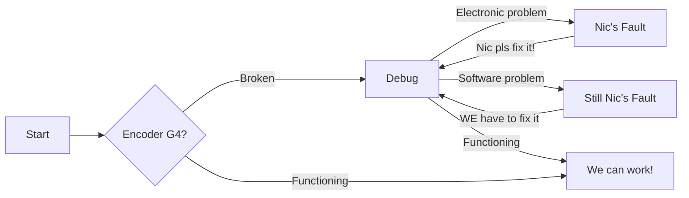

# --- Example documentation structure ---
# Title of section goes here

## Title of subsection goes here

### Maybe put here a nice image, better if it's meme

### What to write

1. General overview of the topic. Simple language, non-technical.
2. Technical structure of the documentation. Add an explanatory schema. (Zensical has support for diagrams, you find examples [here](markdown/#flowcharts)).

3. Actual technical documentation, do your worst.  
Lorem ipsum dolor sit amet, consectetur adipiscing elit, sed do techscursione tempor incididunt ut labore et dolore magna aliqua. Ut enim ad minim veniam, quis nostrud exercitation espnow ullamco laboris nisi ut aliquip ex ea commodo consequat. Duis aute irure dolor in reprehenderit in encoder voluptate velit esse cillum dolore eu fugiat nulla pariatur. Excepteur sint occaecat cupidatat non proident, sunt in culpa qui officia salsiccia mollit anim id est cicciotto laborum sed ut bracciotto unde omnis iste natus error sit voluptatem.