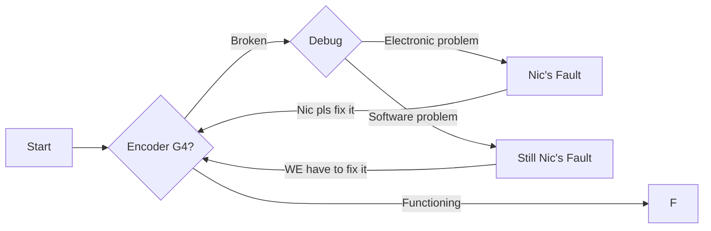

# --- Example documentation structure ---
# Title of section goes here
## Title of subsection goes here

### Maybe put here a nice image, better if it's meme


!!! warning "WARNING"

    Attention: Clown Warning!

### What to write

1. General overview of the topic. Simple language, non-technical.
2. Technical structure of the documentation. Add an explanatory schema or github folder structure. (Zensical has support for diagrams, you find examples [here](markdown/#flowcharts)).

:clown: Example: Clowns repo
```
clowns_folder/                # The clowns of STT
  real_clowns/                # Renowned clowns
    nic.sch                   # It's always an Electronics problem
    federico.md               # Our best and most renown clown
  wannabe_clowns/             # They try to be clowns
    giorgio.xml               # Tried to become a one-eyed clown
    peri.html                 # He tries very hard to be one
not_clowns_folder/            # They are "probably" not clowns
  problably_not_clowns/       # You never know, maybe they are clowns in disguise
    a_gravili.php             # Not a clown, but the detector crashes every time
    viscio.xls                # Sometimes seems like a clown when sleeping 
  absolutely_not_clowns/      # Surely not clowns
    lorenzo.bmp               # The "not clown" god of images compression
    a_santarelli.docx         # Father of the WD-40 family, and they are not clowns
    vincenzo.ppt              # In charge to present Peri's work, while he does clown work
__init__.py                   # empty file, we do not need to initialize clowns, they are already amongst us
clown_detector.py             # Well, you need a way to detect them, sometimes the script crashes
readme_please.txt             # Or maybe not
```


1. Actual technical documentation, do your worst.  
Lorem ipsum dolor sit amet, consectetur adipiscing elit, sed do techscursione tempor incididunt ut labore et dolore magna aliqua. Ut enim ad minim veniam, quis nostrud exercitation espnow ullamco laboris nisi ut aliquip ex ea commodo consequat. Duis aute irure dolor in reprehenderit in encoder voluptate velit esse cillum dolore eu fugiat nulla pariatur. Excepteur sint occaecat cupidatat non proident, sunt in culpa qui officia salsiccia mollit anim id est cicciotto laborum sed ut bracciotto unde omnis iste natus error sit voluptatem.

