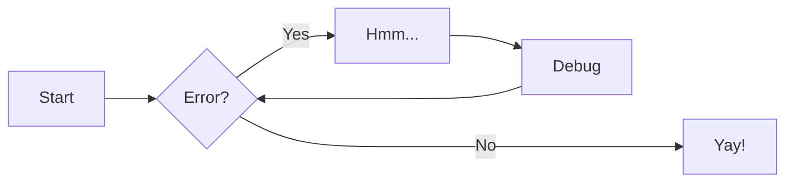
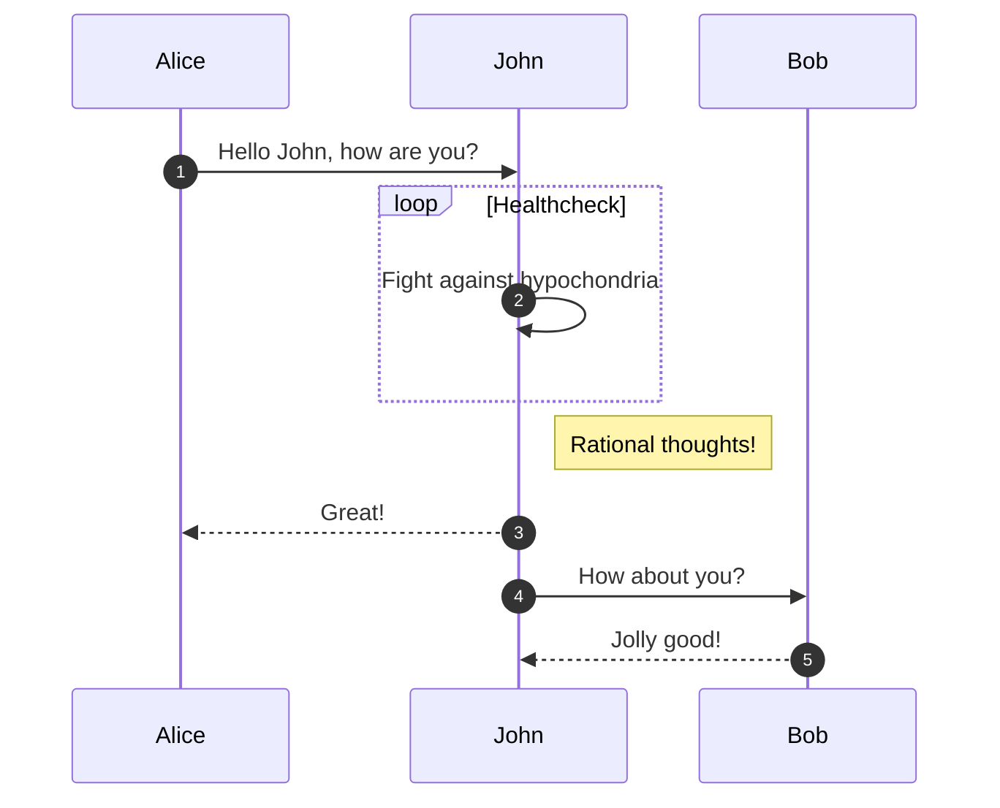
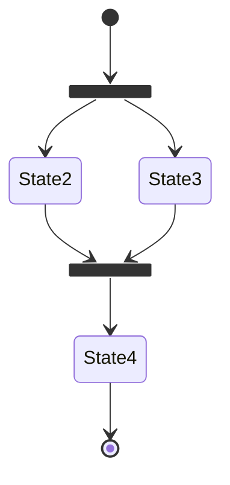
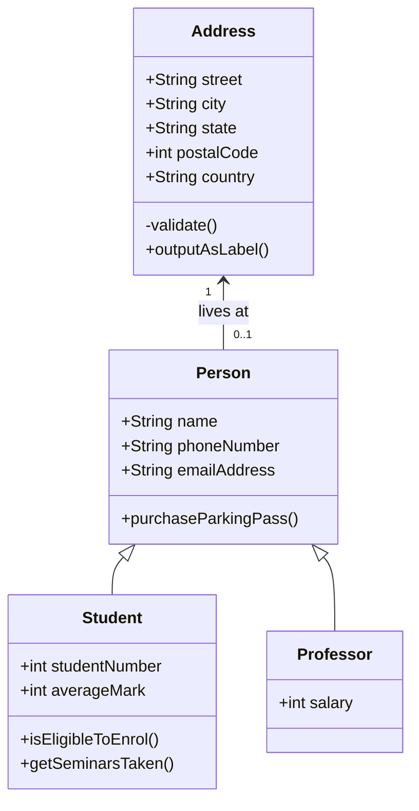

# Markdown for dummies

Here is a [Demo page](https://docs.owid.io/projects/etl/guides/demo/) for all Zensical features

esempio pazzo

### Contenuto

=== "Testo pazzo"

    semplice testo

=== "Lista non ordinata"

    * suca
    * pagliaccio
    * pazzo

=== "Lista ordinata"

    1. Primo
    2. Secondo
    3. Terzo

!!! note "SEI PAZZO"

    questa è una nota pazza sgravata

???+ info "Questa nota pazza si piegha"

    guarda questo [link](https://squidfunk.github.io/mkdocs-material/reference/admonitions/?h=ad).


## Project layout

    zensical.toml    # The configuration file.
    docs/
        index.md  # The documentation homepage.
        ...       # Other markdown pages, images and other files.

```py title="titolo.py" linenums="15"
def puzza():

    return 
```

## Headers
```
# H1 Header
## H2 Header
### H3 Header
#### H4 Header
##### H5 Header
###### H6 Header
```

## Text formatting
```
**bold text**
*italic text*
***bold and italic***
~~strikethrough~~
==marked text==
^^underline text^^
`inline code`
```


## Links and images
```
[Link text](https://example.com)
[Link with title](https://example.com "Hover title")


```

## Lists
```
Unordered:
- Item 1
- Item 2
  - Nested item

Ordered:
1. First item
2. Second item
3. Third item
```

## Definition lists
`Definition list`

:   This is the first definition
:   This is the second definition

## Blockquotes
```
> This is a blockquote
> Multiple lines
>> Nested quote
```

## Code blocks
````
```javascript
function hello() {
  console.log("Hello, world!");
}
```
````

## Tables
```
| Header 1 | Header 2 | Header 3 |
|----------|----------|----------|
| Row 1    | Data     | Data     |
| Row 2    | Data     | Data     |
```

## Horizontal rule
```
---
or
***
or
___
```

## Task lists
```
- [x] Completed task
- [ ] Incomplete task
- [ ] Another task
```

## Escaping characters
```
Use backslash to escape: \* \_ \# \`
```

## Line breaks
```
End a line with two spaces  
to create a line break.

Or use a blank line for a new paragraph.
```
## Flowcharts


## Sequence diagrams


## Use state diagrams


## Class diagrams
