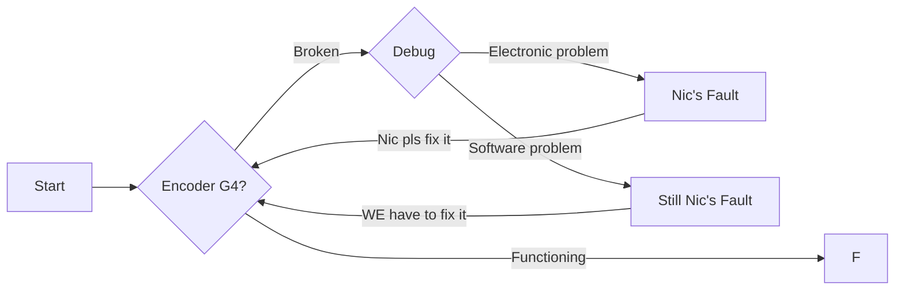
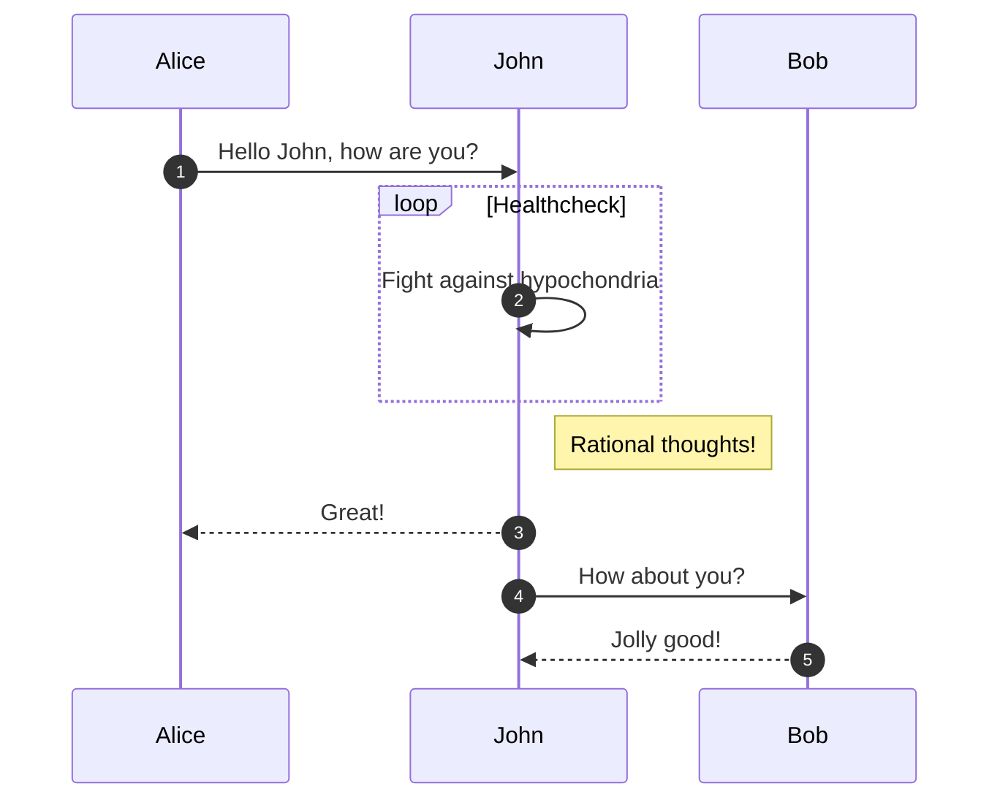
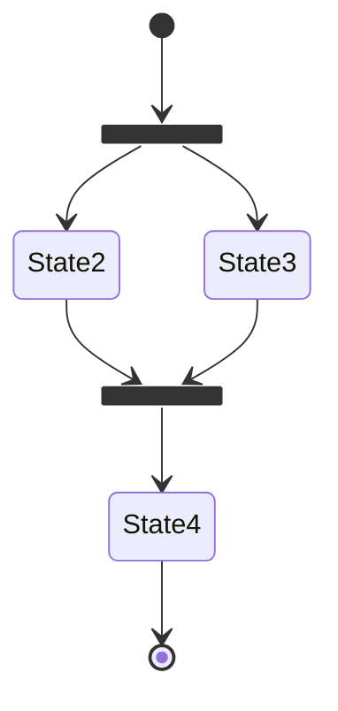
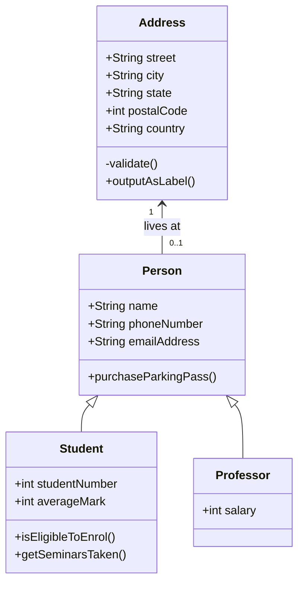

# Markdown for dummies

Here is a [Demo page](https://docs.owid.io/projects/etl/guides/demo/) for all Zensical features

esempio pazzo

### Contenuto

=== "Testo pazzo"

    semplice testo

=== "Lista non ordinata"

    * suca
    * pagliaccio
    * pazzo

=== "Lista ordinata"

    1. Primo
    2. Secondo
    3. Terzo

!!! note "SEI PAZZO"

    questa è una nota pazza sgravata

???+ info "Questa nota pazza si piegha"

    basta metterci un + davanti  
    guarda questo [link](https://squidfunk.github.io/mkdocs-material/reference/admonitions/?h=ad) per altre info.

!!! warning "SEI UN CLOWN"

    se leggi questa nota

!!! bug "BUGGHISSIMO"

    Oh no, uccidetelo!

!!! quote "Poche slide con elementi che si muovono"

    - cit. Giorgio

  


## Project layout

:clown: Example: Clowns repo
```
clowns_folder/                # The clowns of STT
  real_clowns/                # Renowned clowns
    nic.sch                   # It's always an Electronics problem
    federico.md               # Our best and most renown clown
  wannabe_clowns/             # They try to be clowns
    giorgio.xml               # Tried to become a one-eyed clown
    peri.html                 # He tries very hard to be one
not_clowns_folder/            # They are "probably" not clowns
  problably_not_clowns/       # You never know, maybe they are clowns in disguise
    a_gravili.php             # Not a clown, but the detector crashes every time
    viscio.xls                # Sometimes seems like a clown when sleeping 
  absolutely_not_clowns/      # Surely not clowns
    lorenzo.bmp               # The "not clown" god of images compression
    a_santarelli.docx         # Father of the WD-40 family, and they are not clowns
    vincenzo.ppt              # In charge to present Peri's work, while he does clown work
__init__.py                   # empty file, we do not need to initialize clowns, they are already amongst us
clown_detector.py             # Well, you need a way to detect them, sometimes the script crashes
readme_please.txt             # Or maybe not
```
```py title="titolo.py" linenums="15"
def puzza():

    return 
```

## Headers
```
# H1 Header
## H2 Header
### H3 Header
#### H4 Header
##### H5 Header
###### H6 Header
```

## Text formatting
```
*italic text*
**bold text**
***bold and italic***
~~strikethrough~~
==marked text==
^^underline text^^
`inline code`
```


## Links and images
```
[Link text](https://example.com)
[Link with title](https://example.com "Hover title")  


```

??? help "My image is too big!"
        You can use CSS syntax after the image.  
        Example: { width="300" }

??? help "I can't see my image"
      Try to use the html-style syntax. Use this example changing path accordingly:  
      ``````


## Lists
Unordered:

- Item 1
- Item 2
    - Nested item

Ordered:

1. First item
   1. First sub-item of first item
2. Second item
   1. First sub-item of second item
   2. Second sub-item of second item
3. Third item

!!! question "La lista non funziona?"

    Prova a inserire una riga vuota tra titolo della lista ed elementi

## Definition lists

`Definition list`

:   This is the first definition
:   This is the second definition

## Blockquotes

> This is a blockquote
> Multiple lines
>> Nested quote

## Code blocks
````javascript
function hello() {
  console.log("Hello, world!");
}
````

## Tables

| Header 1 | Header 2 | Header 3 |
|----------|----------|----------|
| Row 1    | Data     | Data     |
| Row 2    | Data     | Data     |

## Horizontal rule

---

```
---
or
***
or
___
```

## Task lists
- [x] Completed task
    - [ ] Subtask
- [ ] Incomplete task
- [ ] Another task

## Escaping characters
```
Use backslash to escape: \* \_ \# \`
```

## Line breaks
```
End a line with two spaces  
to create a line break.

Or use a blank line for a new paragraph.
```

## Math & formulas

$\begin{cases}
P=M*g \\
P=2T \\
T=\mu F
\end{cases} \Rightarrow F=\frac{M*g}{2*\mu}=24,5N$
```
$\begin{cases}
P=M*g \\
P=2T \\
T=\mu F
\end{cases} \Rightarrow F=\frac{M*g}{2*\mu}=24,5N$ 
```
$\alpha=\arctan\left(\frac{P}{\pi*d}\right)$  
```
$\alpha=\arctan\left(\frac{P}{\pi*d}\right)$ 
```

## Flowcharts

``` mermaid
graph LR
  A[Start] --> B{Encoder G4?};
  B -->|Broken| C{Debug};
  C -->|Electronic problem| D[Nic's Fault];
  D -->|Nic pls fix it| B;
  C -->|Software problem| E[Still Nic's Fault];
  E -->|WE have to fix it| B;
  B ---->|Functioning| F;
```

## Sequence diagrams

``` mermaid
sequenceDiagram
  autonumber
  Alice->>John: Hello John, how are you?
  loop Healthcheck
      John->>John: Fight against hypochondria
  end
  Note right of John: Rational thoughts!
  John-->>Alice: Great!
  John->>Bob: How about you?
  Bob-->>John: Jolly good!
```

## Use state diagrams

``` mermaid
stateDiagram-v2
  state fork_state <<fork>>
    [*] --> fork_state
    fork_state --> State2
    fork_state --> State3

    state join_state <<join>>
    State2 --> join_state
    State3 --> join_state
    join_state --> State4
    State4 --> [*]
```

## Class diagrams

``` mermaid
classDiagram
  Person <|-- Student
  Person <|-- Professor
  Person : +String name
  Person : +String phoneNumber
  Person : +String emailAddress
  Person: +purchaseParkingPass()
  Address "1" <-- "0..1" Person:lives at
  class Student{
    +int studentNumber
    +int averageMark
    +isEligibleToEnrol()
    +getSeminarsTaken()
  }
  class Professor{
    +int salary
  }
  class Address{
    +String street
    +String city
    +String state
    +int postalCode
    +String country
    -validate()
    +outputAsLabel()
  }
```